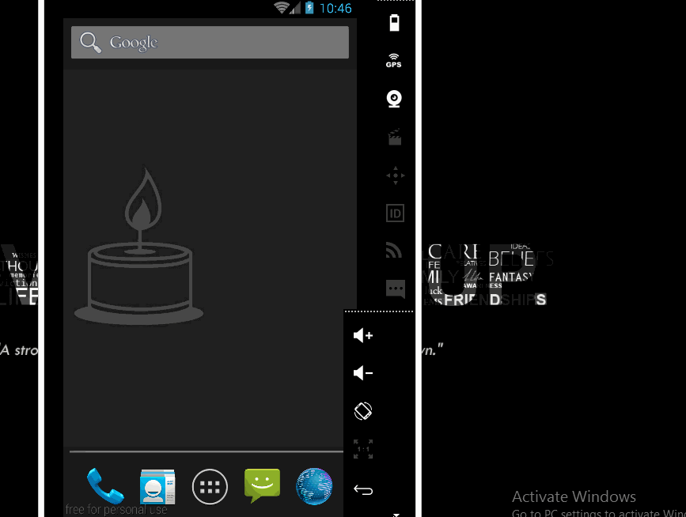

# VoMinh
An small demo app to complete the project 1. See the Tutorial on our cliffnotes for a step-by-step tutorial.

Time spent: 4 hours implementation (included searching) in total
 - 06/30: 1 hour
 - 07/01: 3 hours

Implement link: https://github.com/TienVNguyen/VoMinhProject/tree/master/VoMinhProject

Completed these requirements:
 * [x] At least one photo representing the business
 * [x] Business Name
 * [x] Phone number or email address for the business
 * [x] Address of the Business

Options components:
 * [x] Website for the business
 * [x] Hours of operation

 
Notes:

Walkthrough of all functionalities:

